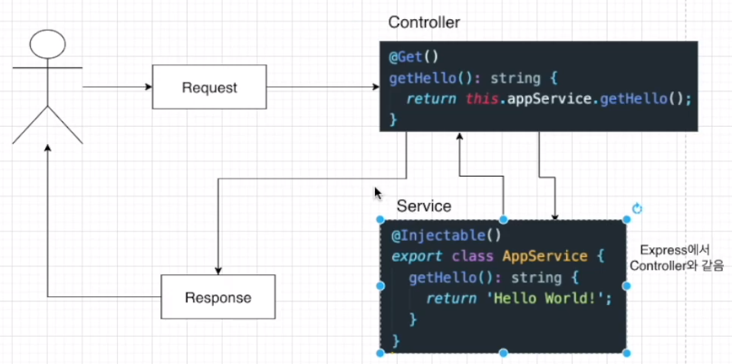

# Nest.js-Study

- 공식 문서 : https://docs.nestjs.com/
- 참고 강의 (인프런, 따라하며 배우는 Nest.js) : https://www.inflearn.com/course/%EB%94%B0%EB%9D%BC%ED%95%98%EB%8A%94-%EB%84%A4%EC%8A%A4%ED%8A%B8-%EC%A0%9C%EC%9D%B4%EC%97%90%EC%8A%A4

### 목차

1. [Nest.js의 기본 개념](#1-nestjs의-기본-개념)
2. [Nest JS 설치 방법](#2-nest-js-시작하기)
3. [기본 CRUD (로컬 메모리)](<#3-기본-crud-방법-(로컬-메모리)>)
4. [PostgreSQL & TypeORM](#4-postgresql-&-typeorm)
5. [JWT 모듈을 통한 인증 처리](#5-jwt-모듈을-통한-인증-처리)
6. [JWT와 PASSPORT 모듈을 이용한 권한 처리](#6-jwt와-passport-모듈을-이용한-권한-처리)
7. [어플리케이션 로그 남기기](#7-어플리케이션-로그-남기기)
8. [AWS 등 클라우드 배포 시 설정](#8-aws-등-클라우드-배포-시-설정)
   <br/><br/>

## 1. Nest.js의 기본 개념

### Nest JS 란?

- Nest는 효율적이고 확장 가능한 Node.js 서버 측 애플리케이션을 구축하기 위한 프레임워크이다.
  - Node.js 애플리케이션을 조금 더 쉽고 많은 기능을 사용할 수 있도록 이미 다 구현 해 놓은 프레임워크라고 볼 수 있다.
- Nest는 프로그레시브 자바스크립트를 사용하고 대부분이 TypeScript로 구현 되어 있기 때문에 TypeScript 개발과 빌드 등을 완벽하게 지원한다는 특징이 있다.
  - Progressive JavaScript : 웹과 네이티브 앱의 이점을 모두 수용하여 사용할 수 있는 표준 패턴을 활용하는 개발 방법론이다.
    - ex) 웹의 이점
      - 접근성 : 브라우저만 있으면 어디서나 접근할 수 있다.
      - 빠른 업데이트 : 업데이트를 서버 측에서 진행하기 때문에 사용자들은 앱을 업데이트 할 필요가 없다.
      - 다양한 플랫폼 지원 : 크로스 플랫폼 지원이 용이하며, 사용자의 디바이스나 운영체제에 관계없이 동일한 웹을 사용할 수 있다.
    - ex) 앱의 이점
      - 네이티브 기능 활용 : 앱은 기기의 하드웨어 및 소프트웨어 기능을 직접 활용할 수 있다. ex) 카메라 엑세스, 위치 정보, 푸시 알림 등
      - 오프라인 기능 : 오프라인 상태(인터넷에 연결되어 있지 않을 때)에서도 일부 기능을 제공할 수 있다.
      - 성능 최적화 : 디바이스에 직접 설치되므로 웹보다 더 빠른 성능을 제공한다.
      - 사용자 경험 : 앱은 보다 높은 사용자 경험과 인터페이스를 제공할 수 있다.

### Nest JS 의 내부 구조

- Nest는 내부적으로 Express와 같은 강력한 HTTP 서버 프레임 워크를 기본적으로 사용하며, 선택적으로 Fastify를 사용하도록 구성할 수 있다. (Nest는 Express를 토대로 만들어졌다.)
- Nest는 이러한 공통 Node.js 프레임워크(express/fastify) 위에 추상화 수준을 제공하지만
  - 추상화 수준 : 복잡한 시스템이나 데이터를 단순화하여 중요한 부분을 강조하는 것으로, 프로그래밍에서 중요한 개념 중 하나이다.

### Nest JS의 철학

- Nest는 개발자와 팀이 고도의 테스트 가능한, 확장성 있는, 유지 관리가 쉬운 애플리케이션을 만들 수 있는 아키텍처를 제공한다.
  - 해당 아키텍처(플랫폼에 맞는 서비스의 설계)는 Angular에서 크게 영감을 받았다.
- 보통 Express를 사용하면 테스팅 기능, 타입스크립트 설정, 로그 기능 등의 많은 설정을 덧붙여 줘야 하지만 Nest를 사용하면 굉장히 손쉽게 명령어를 가지고 해당 기능들을 활용할 수 있기 때문에 편리하다는 장점이 있다.

### Nest JS의 Controller 란?


- 컨트롤러는 들어오는 요청을 처리하고 클라이언트에 응답을 반환하는 역할을 하며, @Controler 테코레이터로 클래스를 데코레이션하여 정의된다.

```
@Controller('/boards')
export class BoardsController{}
```

- 데코레이터의 인자로는 Controller에 의하여 처리될 라우터 경로를 지정하여 주면 된다.

### Nest JS의 Handler 란?

- 핸들러는 @Get, @Post, @Delete 등과 같이 데코레이터로 장식된 컨트롤러 클래스 내부의 단순한 메서드이다.

```
@Controller('/boards')
export class BoardsController {
  @Get()
  getBoards(): string {
    return 'This action returns all boards';
  }
}
```

### Nest JS의 Providers 란?

- 프로바이더는 Nest의 기본 개념으로, 대부분의 기본 Nest 클래스는 서비스, 리포지토리, 팩토리, 헬퍼 등의 프로바이더로 등록할 수 있다.
- 프로바이더의 주요 특징은, 종속성으로 `주입`할 수 있다는 점이다. (즉, 객체는 서로 다양한 관계를 맺을 수 있으며, 객체의 인스턴스를 연결하는 기능은 대부분 Nest 런타임 시스템에 위임될 수 있다고 한다.)
- 프로바이더 : 의존성 주입 패턴에서 사용되는 용어로, 애플리케이션의 다양한 부분에 필요한 객체나 서비스를 제공하는 역할을 수행하는 것이다. Nest.js의 프로바이더는 클래스의 인스턴스를 생성하고 관리하며, 다른 클래스에서 이를 주입하여 컨트롤러 등에서 사용할 수 있도록 해준다.

### Provider 등록 방법

- Provider를 사용하기 위해서는 해당 프로바이더를 Nest.js의 module 파일에 등록해 줘야 사용할 수 있다.
- module 파일의 providers 항목 안에 사용하고자 하는 provider를 넣어주면 된다.

```
import { Module } from '@nestjs/common';
import { BoardsController } from './boards.controller';
import { BoardsService } from './boards.service';

@Module({
  controllers: [BoardsController],
  providers: [BoardsService]
})
export class BoardsModule {}
```

### Nest JS의 Service 란?

- 서비스는 소프트웨어 개발 내의 공통적인 개념으로, 컨트롤러에서 데이터의 유효성 체크를 하거나 데이터베이스에 아이템을 생성하는 등의 작업을 하는 부분을 말한다.
  - 컨트롤러에서 구현해도 되지만, 주로 서비스에서 주로 구현하고 해당 리턴값을 다시 컨트롤러에 주고 컨트롤러에서 다시 응답하여 클라이언트에 전달하는 방식으로 구현하게 된다.
- Nest.js의 서비스는 @Injectable 데코레이터로 감싸져 모듈에 제공된다. 이 인스턴스는 애플리케이션 전체에서 사용될 수 있다.
  

### Service를 Controller에서 이용할 수 있는 방법

- this.appService.getHello(); 이런 식으로 Service에 정의해 놓은 메서드를 아래와 같은 방법으로 구현하면 Controller에서 가져와 사용(종속성 주입)할 수 있다.

```
import { Controller, Get, Param } from '@nestjs/common';
import { BoardsService } from './boards.service';
import { Board } from './boards.model'

@Controller('boards')
export class BoardsController {
  constructor(private boardsService: BoardsService) {}

  @Get('/:id')
  getBoardById(@Param('id') is: string): Board {
    return this.boardsService.getBoardById(id);
  }
}
```

- 위 코드를 보면, BoardsService를 Contuctor 클래스에서 가져오고(Injected) 있다. 이후 Private 문법을 사용해 boardsService를 정의하여 Controller 안에서 사용할 수 있게 만들었다. 이렇게 할 수 있는 이유는 타입스크립트의 기능을 이용해서 종속성을 타입으로 해결할 수 있기 때문이다.

<br/><br/>

## 2. Nest JS 시작하기

### 설치 및 시작 방법

- NestJS 를 이용해서 프로젝트를 시작할 때 Nest CLI를 이용하면 간단히 프로젝트를 시작할 수 있다.
- Nest CLI를 이용하여 다음과 같은 명령어를 작성하면 새 프로젝트의 디렉토리가 생성되고, 초기 핵심 Nest 파일 및 지원 모듈로 디렉토리가 채워지며 프로젝트의 기본 구조가 생성된다.

1. NestJS CLI를 글로벌로 설치한다.
   ```
   npm i -g @nestjs/cli
   ```
   - NestJS 가 잘 설치되어 있는지 확인 : `nest --version`
2. 원하는 프로젝트 명으로 nest 프레임워크 프로젝트를 생성한다.
   ```
   nest new project-name
   ```
   - npm, yarn, pnpm 중 사용을 원하는 패키지 매니저를 골라준다. (npm 을 선택해 주었다.)
     <br/><br/>
   - 혹은 현재 폴더 위치에 프로젝트를 생성한다. `nest new ./`

### Nest JS 기본 구조 설명

- `.eslintrc.js` : 개발자들이 특정한 규칙을 가지고 코드를 깔끔하게 짤 수 있도록 도와주는 라이브러리를 설정하는 파일이다. 이는 타입스크립트를 쓰는 가이드 라인을 제시하거나, 문법에 오류가 나면 알려주는 역할 등을 수행한다.
- `.prettierrc` : 주로 코드 형식을 맞추는 데에 사용한다. 작은 따옴표(')를 사용할지 큰 따옴표(")를 사용할지, Indent 값을 2로 줄지 4로 줄지 등의 코드 포매터 역할을 한다.
- `nest-cli.json` : nest 프로젝트 자체를 위해 특정한 설정을 할 수 있는 json 파일이다. "sourceRoot" 는 프로젝트의 대부분의 로직이 "src" 폴더에 있다는 것을 설정해준 것이다.
- `tsconfig.json` : 타입스크립트 컴파일을 어떻게 할지 등을 설정하는 파일이다.
- `tsconfig.build.json` : tsconfig.json의 연장선상의 파일이며, build를 할 때 필요한 설정들을 지정한다. "excludes" 에서는 빌드할 때 필요 없는 파일들을 명시할 수 있다.
- `package.json` : 프로젝트 이름, 버전, 설명, 작성자, 프로젝트 실행 명령어, 라이브러리 등의 의존성 정보를 지정하거나 볼 수 있는 파일이다.
- `src 폴더` : 대부분의 비즈니스 로직이 들어가는 폴더이다.
  - `main.ts` : 어플리케이션을 생성(AppModule)하고 실행하도록 시작점을 설정하는 파일이다.

### 기본 구조에서 살펴보는 로직 흐름


### 실행 방법

- 해당 NestJS 프로젝트 루트에서 `npm run start:dev` 명령어를 입력하여 실행하여 준다.
  - start:dev : package.json에 있는 개발 모드로 시작할 때의 스크립트이다.
- 시작을 하게 되면 dist 폴더가 생성되고, LOG가 찍히면서 프로젝트가 잘 실행됨을 확인할 수 있다.

### 모듈 생성 방법

- boards 모듈 생성 명령어(프로젝트 루트 경로) : `nest g module boards`
  - nest : using nestcli
  - g : generate
  - module : schematic that i want to create
  - boards : name of the schematic
- 해당 명령어를 입력하면 src에 boards 폴더 및 boards 모듈이 생성된다.

### 컨트롤러 생성 방법


- boards 컨트롤러 생성 명령어(프로젝트 루트 경로) : `nest g controller boards --no-spec`
  - --no-spec : 테스트를 위한 소스 코드 생성을 하지 않겠다는 명령어이다.
- 해당 명령어를 입력하면 src의 boards에 boards 컨트롤러가 생성된다.

## 3. 기본 CRUD 방법 (로컬 메모리)

### CRUD 구현 예정 구조

- 기본적인 제목과 내용이 포함된 공개/비공개 게시글 CRUD
  
- Study를 하면서 NestJS 를 통하여 구현할 구조
  
  - 게시글을 만드는 것이므로 `게시글에 관한 모듈`과 그 `게시글을 만드는 사람에 대한 인증 모듈`이 필요하여 크게 두 가지 모듈로 나누었다.
  - 또한, 각 모듈을 구성하는 Controller, Service, Repository 등이 있는데 이러한 경우 NestJS에서는 어떠한 용도로 사용되는지, BoardModule 안에는 BoardController, BoardEntity, BoardService, BoardRepository, ValidationPipe와 같은 부분이 있는데 각 부분은 어떤 기능을 수행하는지 등에 대하여 알아 볼 예정이다.
    <br/><br/>

## 4. PostgreSQL & TypeORM

<br/><br/>

## 5. JWT 모듈을 통한 인증 처리

<br/><br/>

## 6. JWT와 PASSPORT 모듈을 이용한 권한 처리

<br/><br/>

## 7. 어플리케이션 로그 남기기

<br/><br/>

## 8. AWS 등 클라우드 배포 시 설정

<br/><br/>
