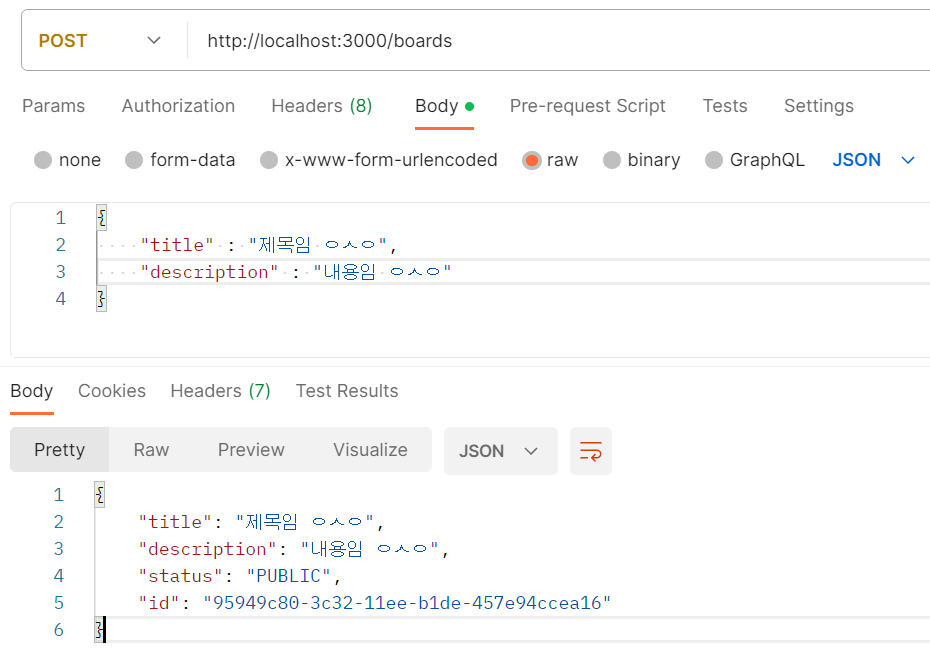

# Nest.js-Study

- 공식 문서 : https://docs.nestjs.com/
- 참고 강의 (인프런, 따라하며 배우는 Nest.js) : https://www.inflearn.com/course/%EB%94%B0%EB%9D%BC%ED%95%98%EB%8A%94-%EB%84%A4%EC%8A%A4%ED%8A%B8-%EC%A0%9C%EC%9D%B4%EC%97%90%EC%8A%A4

### 목차

1. [Nest.js의 기본 개념](#1-nestjs의-기본-개념)
2. [Nest JS 설치 방법](#2-nest-js-시작하기)
3. [기본 CRUD (로컬 메모리)](#3-기본-crud-방법-로컬-메모리)
4. [Pipe 이용 방법](#4-pipe-이용)
5. [PostgreSQL & TypeORM](#5-postgresql--typeorm)
6. [JWT 모듈을 통한 인증 처리](#6-jwt-모듈을-통한-인증-처리)
7. [JWT와 PASSPORT 모듈을 이용한 권한 처리](#7-jwt와-passport-모듈을-이용한-권한-처리)
8. [어플리케이션 로그 남기기](#8-어플리케이션-로그-남기기)
9. [AWS 등 클라우드 배포 시 설정](#9-aws-등-클라우드-배포-시-설정)
   <br/><br/>

## 1. Nest.js의 기본 개념

### Nest JS 란?

- Nest는 효율적이고 확장 가능한 Node.js 서버 측 애플리케이션을 구축하기 위한 프레임워크이다.
  - Node.js 애플리케이션을 조금 더 쉽고 많은 기능을 사용할 수 있도록 이미 다 구현 해 놓은 프레임워크라고 볼 수 있다.
- Nest는 프로그레시브 자바스크립트를 사용하고 대부분이 TypeScript로 구현 되어 있기 때문에 TypeScript 개발과 빌드 등을 완벽하게 지원한다는 특징이 있다.
  - Progressive JavaScript : 웹과 네이티브 앱의 이점을 모두 수용하여 사용할 수 있는 표준 패턴을 활용하는 개발 방법론이다.
    - ex) 웹의 이점
      - 접근성 : 브라우저만 있으면 어디서나 접근할 수 있다.
      - 빠른 업데이트 : 업데이트를 서버 측에서 진행하기 때문에 사용자들은 앱을 업데이트 할 필요가 없다.
      - 다양한 플랫폼 지원 : 크로스 플랫폼 지원이 용이하며, 사용자의 디바이스나 운영체제에 관계없이 동일한 웹을 사용할 수 있다.
    - ex) 앱의 이점
      - 네이티브 기능 활용 : 앱은 기기의 하드웨어 및 소프트웨어 기능을 직접 활용할 수 있다. ex) 카메라 엑세스, 위치 정보, 푸시 알림 등
      - 오프라인 기능 : 오프라인 상태(인터넷에 연결되어 있지 않을 때)에서도 일부 기능을 제공할 수 있다.
      - 성능 최적화 : 디바이스에 직접 설치되므로 웹보다 더 빠른 성능을 제공한다.
      - 사용자 경험 : 앱은 보다 높은 사용자 경험과 인터페이스를 제공할 수 있다.

### Nest JS 의 내부 구조

- Nest는 내부적으로 Express와 같은 강력한 HTTP 서버 프레임 워크를 기본적으로 사용하며, 선택적으로 Fastify를 사용하도록 구성할 수 있다. (Nest는 Express를 토대로 만들어졌다.)
- Nest는 이러한 공통 Node.js 프레임워크(express/fastify) 위에 추상화 수준을 제공하지만
  - 추상화 수준 : 복잡한 시스템이나 데이터를 단순화하여 중요한 부분을 강조하는 것으로, 프로그래밍에서 중요한 개념 중 하나이다.

### Nest JS의 철학

- Nest는 개발자와 팀이 고도의 테스트 가능한, 확장성 있는, 유지 관리가 쉬운 애플리케이션을 만들 수 있는 아키텍처를 제공한다.
  - 해당 아키텍처(플랫폼에 맞는 서비스의 설계)는 Angular에서 크게 영감을 받았다.
- 보통 Express를 사용하면 테스팅 기능, 타입스크립트 설정, 로그 기능 등의 많은 설정을 덧붙여 줘야 하지만 Nest를 사용하면 굉장히 손쉽게 명령어를 가지고 해당 기능들을 활용할 수 있기 때문에 편리하다는 장점이 있다.

### Nest JS의 Controller 란?


- 컨트롤러는 들어오는 요청을 처리하고 클라이언트에 응답을 반환하는 역할을 하며, @Controler 테코레이터로 클래스를 데코레이션하여 정의된다.

```
@Controller('/boards')
export class BoardsController{}
```

- 데코레이터의 인자로는 Controller에 의하여 처리될 라우터 경로를 지정하여 주면 된다.

### Nest JS의 Handler 란?

- 핸들러는 @Get, @Post, @Delete 등과 같이 데코레이터로 장식된 컨트롤러 클래스 내부의 단순한 메서드이다.

```
@Controller('/boards')
export class BoardsController {
  @Get()
  getBoards(): string {
    return 'This action returns all boards';
  }
}
```

### Nest JS의 Providers 란?

- 프로바이더는 Nest의 기본 개념으로, 대부분의 기본 Nest 클래스는 서비스, 리포지토리, 팩토리, 헬퍼 등의 프로바이더로 등록할 수 있다.
- 프로바이더의 주요 특징은, 종속성으로 `주입`할 수 있다는 점이다. (즉, 객체는 서로 다양한 관계를 맺을 수 있으며, 객체의 인스턴스를 연결하는 기능은 대부분 Nest 런타임 시스템에 위임될 수 있다고 한다.)
- 프로바이더 : 의존성 주입 패턴에서 사용되는 용어로, 애플리케이션의 다양한 부분에 필요한 객체나 서비스를 제공하는 역할을 수행하는 것이다. Nest.js의 프로바이더는 클래스의 인스턴스를 생성하고 관리하며, 다른 클래스에서 이를 주입하여 컨트롤러 등에서 사용할 수 있도록 해준다.

### Provider 등록 방법

- Provider를 사용하기 위해서는 해당 프로바이더를 Nest.js의 module 파일에 등록해 줘야 사용할 수 있다.
- module 파일의 providers 항목 안에 사용하고자 하는 provider를 넣어주면 된다.

```
import { Module } from '@nestjs/common';
import { BoardsController } from './boards.controller';
import { BoardsService } from './boards.service';

@Module({
  controllers: [BoardsController],
  providers: [BoardsService]
})
export class BoardsModule {}
```

### Nest JS의 Service 란?

- 서비스는 소프트웨어 개발 내의 공통적인 개념으로, 컨트롤러에서 데이터의 유효성 체크를 하거나 데이터베이스에 아이템을 생성하는 등의 작업을 하는 부분을 말한다.
  - 컨트롤러에서 구현해도 되지만, 주로 서비스에서 주로 구현하고 해당 리턴값을 다시 컨트롤러에 주고 컨트롤러에서 다시 응답하여 클라이언트에 전달하는 방식으로 구현하게 된다.
- Nest.js의 서비스는 @Injectable 데코레이터로 감싸져 모듈에 제공된다. 이 인스턴스는 애플리케이션 전체에서 사용될 수 있다.
  

### Service 생성 방법

1. 우선, 데이터베이스에서 데이터를 가져오거나 게시판 생성시 해당 데이터를 넣어주는 등의 로직을 처리하기 전 boards라는 이름의 service를 먼저 생성하여 준다.
   - boards service 생성 명령어(프로젝트 루트 경로) : `nest g service boards --no-spec`
   - 위 명령어를 입력하면 src 폴더의 boards 폴더 내에 boards.service.ts 파일이 생성되며 module의 provider 부분에 해당 service가 등록된다. 해당 service 내부에서 데이터베이스 관련 작업들을 해주면 된다.

### Service를 Controller에서 이용할 수 있는 방법 (종속성 주입, Dependency Injection)

- this.appService.getHello(); 이런 식으로 Service에 정의해 놓은 메서드를 아래와 같은 방법으로 구현하면 Controller에서 가져와 사용(종속성 주입)할 수 있다.

```
import { Controller, Get, Param } from '@nestjs/common';
import { BoardsService } from './boards.service';
import { Board } from './boards.model'

@Controller('boards')
export class BoardsController {
  constructor(private boardsService: BoardsService) {}

  @Get('/:id')
  getBoardById(@Param('id') is: string): Board {
    return this.boardsService.getBoardById(id);
  }
}
```

- 위 코드를 보면, BoardsService를 Contuctor 클래스에서 가져오고(Injected) 있다. 이후 Private 문법을 사용해 boardsService를 정의하여 Controller 안에서 사용할 수 있게 만들었다. 이렇게 할 수 있는 이유는 타입스크립트의 기능을 이용해서 종속성을 타입으로 해결할 수 있기 때문이다.
- BoardsService를 타입스크립트의 타입으로 정의하여 사용
- private 등의 접근 제한자는 JavaScript에서 사용할 수 없지만 TypeScript에선 사용 가능하다.
- 해당 접근 제한자(private)를 이용하여 생성자 내부에 파라미터를 선언하게 되면 BoardsService 파라미터가 암묵적으로 BoardsController 클래스 내의 boardsService 프로퍼티로 선언된다.

<br/><br/>

## 2. Nest JS 시작하기

### 설치 및 시작 방법

- NestJS 를 이용해서 프로젝트를 시작할 때 Nest CLI를 이용하면 간단히 프로젝트를 시작할 수 있다.
- Nest CLI를 이용하여 다음과 같은 명령어를 작성하면 새 프로젝트의 디렉토리가 생성되고, 초기 핵심 Nest 파일 및 지원 모듈로 디렉토리가 채워지며 프로젝트의 기본 구조가 생성된다.

1. NestJS CLI를 글로벌로 설치한다.
   ```
   npm i -g @nestjs/cli
   ```
   - NestJS 가 잘 설치되어 있는지 확인 : `nest --version`
2. 원하는 프로젝트 명으로 nest 프레임워크 프로젝트를 생성한다.
   ```
   nest new project-name
   ```
   - npm, yarn, pnpm 중 사용을 원하는 패키지 매니저를 골라준다. (npm 을 선택해 주었다.)
     <br/><br/>
   - 혹은 현재 폴더 위치에 프로젝트를 생성한다. `nest new ./`

### Nest JS 기본 구조 설명

- `.eslintrc.js` : 개발자들이 특정한 규칙을 가지고 코드를 깔끔하게 짤 수 있도록 도와주는 라이브러리를 설정하는 파일이다. 이는 타입스크립트를 쓰는 가이드 라인을 제시하거나, 문법에 오류가 나면 알려주는 역할 등을 수행한다.
- `.prettierrc` : 주로 코드 형식을 맞추는 데에 사용한다. 작은 따옴표(')를 사용할지 큰 따옴표(")를 사용할지, Indent 값을 2로 줄지 4로 줄지 등의 코드 포매터 역할을 한다.
- `nest-cli.json` : nest 프로젝트 자체를 위해 특정한 설정을 할 수 있는 json 파일이다. "sourceRoot" 는 프로젝트의 대부분의 로직이 "src" 폴더에 있다는 것을 설정해준 것이다.
- `tsconfig.json` : 타입스크립트 컴파일을 어떻게 할지 등을 설정하는 파일이다.
- `tsconfig.build.json` : tsconfig.json의 연장선상의 파일이며, build를 할 때 필요한 설정들을 지정한다. "excludes" 에서는 빌드할 때 필요 없는 파일들을 명시할 수 있다.
- `package.json` : 프로젝트 이름, 버전, 설명, 작성자, 프로젝트 실행 명령어, 라이브러리 등의 의존성 정보를 지정하거나 볼 수 있는 파일이다.
- `src 폴더` : 대부분의 비즈니스 로직이 들어가는 폴더이다.
  - `main.ts` : 어플리케이션을 생성(AppModule)하고 실행하도록 시작점을 설정하는 파일이다.

### 기본 구조에서 살펴보는 로직 흐름


### 실행 방법

- 해당 NestJS 프로젝트 루트에서 `npm run start:dev` 명령어를 입력하여 실행하여 준다.
  - start:dev : package.json에 있는 개발 모드로 시작할 때의 스크립트이다.
- 시작을 하게 되면 dist 폴더가 생성되고, LOG가 찍히면서 프로젝트가 잘 실행됨을 확인할 수 있다.

### 모듈 생성 방법

- boards 모듈 생성 명령어(프로젝트 루트 경로) : `nest g module boards`
  - nest : using nestcli
  - g : generate
  - module : schematic that i want to create
  - boards : name of the schematic
- 해당 명령어를 입력하면 src에 boards 폴더 및 boards 모듈이 생성된다.

### 컨트롤러 생성 방법


- boards 컨트롤러 생성 명령어(프로젝트 루트 경로) : `nest g controller boards --no-spec`
  - --no-spec : 테스트를 위한 소스 코드 생성을 하지 않겠다는 명령어이다.
- 해당 명령어를 입력하면 src의 boards에 boards 컨트롤러가 생성된다.

## 3. 기본 CRUD 방법 (로컬 메모리)

### CRUD 구현 예정 구조

- 기본적인 제목과 내용이 포함된 공개/비공개 게시글 CRUD
  
- Study를 하면서 NestJS 를 통하여 구현할 구조
  
  - 게시글을 만드는 것이므로 `게시글에 관한 모듈`과 그 `게시글을 만드는 사람에 대한 인증 모듈`이 필요하여 크게 두 가지 모듈로 나누었다.
  - 또한, 각 모듈을 구성하는 Controller, Service, Repository 등이 있는데 이러한 경우 NestJS에서는 어떠한 용도로 사용되는지, BoardModule 안에는 BoardController, BoardEntity, BoardService, BoardRepository, ValidationPipe와 같은 부분이 있는데 각 부분은 어떤 기능을 수행하는지 등에 대하여 알아 볼 예정이다.
    <br/><br/>

### Read : 모든 게시물을 가져오는 서비스 만들기

- 해당 로직은 Service에서 구현해 주면 되며, 우선 데이터베이스를 연결하지 않고 데이터를 로컬 메모리에 담아 처리한다.

```
import { Injectable } from 'nestjs/common';

@Injectable()
export class BoardsService {
  private boards = []; // 게시물 데이터 저장

  getAllBoards() { // 모든 게시물 정보 출력 메서드
    return this.boards;
  }
}
```

- 위 코드에서 private 접근제한자를 사용한 이유는 다른 컴포넌트에서 해당 배열 값을 수정할 수 없도록 접근을 제한하기 위함이다.

- 이후 아래와 같이 boards controller에 해당 라우팅을 설정해준다.

```
import { Controller, Get } from '@nestjs/common';
import { BoardsService } from './boards.service';

@Controller('boards')
export class BoardsController {
  constructor(private boardsService: BoardsService) {}

  @Get() // Get 데코레이터 지정
  getAllBoard() { // getAllBoard() 메서드 선언
    return this.boardsService.getAllBoards(); // 서비스 메서드 호출
  }
}
```

- 위와 같은 처리가 완료되면, `npm run start:dev`로 서버를 실행하고 http://localhost:3000/boards 접근 시 해당 게시글 목록이 출력된다.

### 모델 정의하기

- src/boards 폴더 내에 board.model.ts 파일을 생성하여 아래와 같이 모델의 타입을 인터페이스 혹은 클래스 방식으로 정의하여 준다.

```
export interface Board {
  id: string;
  title: string;
  description: string;
  status: BoardStatus; // 공개, 비공개 상태
}

export enum BoardStatus {
  PUBLIC = 'PUBLIC',
  PRIVATE = 'PRIVATE',
}
```

- 이후 게시물 출력 등의 메서드에 출력 타입 등을 해당 모델로 정의해 주어도 된다.

### Create : 게시물 생성

#### 게시물을 생성하는 서비스 만들기

- 우선 service에서 게시물에 관한 로직을 처리하고, 이후 controller에서 서비스를 불러와 준다.
- boards.service.ts에 아래와 같이 게시글 생성 메서드를 정의하여 준다.

```
  createBoard(title: string, description: string) {
    const board: Board = {
      title,
      description,
      status: BoardStatus.PUBLIC, // 기본 공개 상태
      id: uuid(), // 임시 유니크 아이디 지정(uuid 모듈 활용)
    };

    this.boards.push(board); // 게시물 목록(로컬 메모리)에 추가
    return board; // 생성된 게시물 정보 리턴
  }
```

- 로컬 메모리에서 id를 유니크한 값으로 지정하기 위하여 uuid라는 모듈을 사용하였다.

#### uuid 모듈 사용법

1. uuid 모듈 설치 (프로젝트 루트 경로) : `npm i uuid --save`
2. uuid 모듈 임포트 : `import { v1 as uuid } from 'uuid';`
3. uuid를 호출하여 유니크한 값 생성 : `uuid()`

#### 게시물을 생성하는 Controller 만들기

- service에 로직을 구현하였다면 이제 controller에서 해당 기능을 활용하여 아래와 같이 메서드를 만들어 요청과 응답을 구현하여 준다.

```
  @Post()
  createBoard() {

  }
```

- 또한 Nest.js 에서는 요청값을 받을 때 아래와 같이 데코레이션으로 받아준다.

```
  @Post()
  createBoard(@Body() body) {
    console.log({ body });
  }
```

- 만약 값을 하나만 받아오고 싶다면 아래와 같이 `@Body('title') title` 과 같은 형태로 가져올 수도 있다.

```
  @Post()
  createBoard(@Body('description') description) {
    console.log({ description });
  }
```

- 아래 코드와 같이 여러 요청값을 정의하여 받아와 타입을 정의하여 주어도 된다.

```
  @Post()
  createBoard(
    @Body('title') title: string,
    @Body('description') description: string,
  ) {
    console.log({ title, description });
  }
```

- 아래와 같은 방식으로 값을 받아와도 될 듯 한데, 위와 같은 방식이 더 보기 좋은 것 같다. (혜림)

```
  @Post()
  createBoard(@Body() body) {
    const { title, description }: { title: string; description: string } = body;
    console.log({ title, description });
  }
```

- 이제 실제 게시글을 생성하는 서비스 메서드를 가져와 호출함과 동시에 리턴해 준다.

```
  @Post()
  createBoard(
    @Body('title') title: string,
    @Body('description') description: string,
  ): Board {
    // 위와 같이 리턴값의 타입을 정해준다.
    console.log({ title, description });
    return this.boardsService.createBoard(title, description);
  }
```

- 컨트롤러 구현이 완료되었다면, 프로젝트 루트 경로에서 `npm run start:dev`를 통하여 서버를 열고, `포스트맨으로 api 요청`을 보내 성공적으로 게시글이 생성되는지 테스트해보면 된다.
  - 테스트 : post 방식으로 http://localhost:3000/boards 에 title과 description을 지정하여 요청을 보내면 응답값이 출력된다.
    

### 데이터 교환 객체 (DTO : Data Transfer Object)

#### DTO 란?

- DTO란 계층 간 데이터 교환을 위한 객체로, DB에서 데이터를 얻어 service 혹은 controller 등으로 보낼 때 사용하는 객체를 말한다.
- DTO는 주로 interface나 class를 이용하여 데이터가 네트워크를 통해 전송되는 방법을 정의한다. (Nest JS는 class를 이용하는 것을 강력 추천하고 있다!)

#### DTO의 장점

- 데이터 교환 객체(DTO) 사용 시 데이터의 유효성을 효율적으로 체크할 수 있으며, 더 안정적인 코드를 만들 수 있다. 또한 타입스크립트의 타입으로도 활용될 수도 있다.
  
- 위 그림과 같이 노란색 박스로 된 부분의 값을 하나라도 수정할 경우 다른 부분도 연결되어 같이 수정하여야 할 부분이 다수 있을 수 있는데, DTO를 활용하면 해당 부분을 실수로 수정하지 못하여 에러가 나는 경우를 방지할 수 있다는 장점이 있다.

#### DTO의 필요성

- 현재 데이터 흐름을 살펴 보면 Board를 위한 프로퍼티들(title, description 등)을 여러 곳에서 사용하고 있다. 지금은 간단한 애플리케이션을 만들기 때문에 몇 개의 프로퍼티만 불러 주고 몇 군데에서만 불러 주면 된다.
- 하지만 정말 많은 프로퍼티를 가지고 정말 여러 군데에서 이용하고 있는 경우 갑자기 한 곳에서 프로퍼티 명을 바꿔 주어야 한다면, 다른 곳에 똑같이 쓰인 모든 곳의 프로퍼티도 똑같이 바꿔 주어야 한다. 그럴 시 애플리케이션의 유지보수성이 급격히 안 좋아지기 때문에 DTO를 사용하여 해결해 주어야 한다.

### 게시물 생성을 위한 DTO 구현

#### DTO 파일 작성

- 클래스는 인터페이스와 다르게 런타임(프로그램이 실행되고 있는 동안)에서 작동하기 때문에 파이프 같은 기능을 이용할 때 더 유용하다.
- 우선 src/boards 폴더에 dto라는 폴더를 생성하여 주고, 해당 폴더에 create-board.dto.ts 파일을 만든 후, 아래와 같이 DTO 클래스를 작성하여 준다.

```
export class CreateBoardDto {
  title: string;
  description: string;
}
```

#### DTO 적용

- 이후 작성한 DTO 파일을 controller와 service에 적용하여 주면 된다.
- 아래와 같이 service에 dto를 적용하여 준다.

  - 기존 코드

  ```
  createBoard(title: string, description: string) {
    const board: Board = {
      title,
      description,
      status: BoardStatus.PUBLIC,
      id: uuid(),
    };

    this.boards.push(board);
    return board;
  }
  ```

  - dto를 적용한 코드

  ```
  createBoard(createBoardDto: CreateBoardDto) {
    const { title, description } = createBoardDto;

    const board: Board = {
      title,
      description,
      status: BoardStatus.PUBLIC,
      id: uuid(),
    };

    this.boards.push(board);
    return board;
  }
  ```

- 아래와 같이 controller에도 dto를 적용하여 준다.
  - 기존 코드
  ```
  @Post()
  createBoard(
    @Body('title') title: string,
    @Body('description') description: string,
  ): Board {
    return this.boardsService.createBoard(title, description);
  }
  ```
  - dto를 적용한 코드
  ```
  @Post()
  createBoard(@Body() createBoardDto: CreateBoardDto): Board {
    return this.boardsService.createBoard(createBoardDto);
  }
  ```

### id로 특정 게시물 가져오기

#### service

```
getBoardById(id: string): Board {
  return this.boards.find((board) => board.id === id);
}
```

#### controller

```
@Get('/:id')
getBoardById(@Param('id') id: string): Board {
  return this.boardsService.getBoardById(id);
}
```

- 만약 여러 개의 파라미터를 받아 가져와야 할 경우 아래와 같이 string 배열 타입으로 지정하여 값을 받아와도 된다.

```
getBoardById(@Param() params: string[]) {}
```

### Update : 특정 게시물의 상태 수정(공개/비공개)

#### service

```
updateBoardStatus(id: string, status: BoardStatus): Board {
  const board = this.getBoardById(id);
  board.status = status;
  return board;
}
```

#### controller

```
@Patch('/:id/status')
updateBoardStatus(
  @Param('id') id: string,
  @Body('status') status: BoardStatus,
) {
  return this.boardsService.updateBoardStatus(id, status)
}
```

- :id는 Param, status는 Body로 값을 받아 온 이유
  - ':' 이 붙은 경우 경로 매개변수로 취급된다. 이에 따라 매개변수(param)와 본문(body)이 나눠지게 되므로 id는 Param, status는 Body로 값을 받아오게 되었다.

### Delete : id로 특정 게시물 삭제

#### service

```
deleteBoard(id: string): void {
  // 아이디가 다른 것만 boards 배열에 남겨 주어 삭제을 구현하였다.
  this.boards = this.boards.filter((board) => board.id !== id);
}
```

#### controller

```
@Delete('/:id')
deleteBoard(@Param('id') id: string): void {
  this.boardsService.deleteBoard(id);
}
```

## 4. Pipe 이용

### Nest JS의 Pipe 란?

#### Pipe 의 정의 및 장점

- 파이프는 @Infectable() 데코레이터로 주석이 달린 클래스이다. 이는 data transformation과 data vaildation을 위해서 사용된다.
- 파이프는 컨트롤러 경로 처리기에 의해 처리되는 인수값에 대하여 작동한다.
- Nest는 메서드가 호출되기 전에 파이프를 삽입하고, 파이프는 메서드로 향하는 인수를 수신하여 이에 대해 작동한다.
  
- 만약 위 그림에서 파이프가 없다면 인수값의 데이터가 바로 통과하여 핸들러 쪽으로 가게 되는데, 파이프가 있다면 인수값의 데이터를 검증하여 실패 시 에러를 발생시킬 수 있게 된다.

#### Data Transformation (데이터 변환)

- 데이터 트랜스 포메이션은 입력한 데이터를 원하는 형식으로 변환하는 것을 뜻한다. ex) 문자열에서 정수로
- 만약 숫자를 받길 원하는데 문자열 형식으로 값이 도착한다면 파이프에서 자동으로 숫자로 바꿔줄 수 있다.

#### Data Validation (유효성 검사)

- 데이터 벨리데이션은 입력 데이터를 평가하여 값이 유효할 경우 그대로 값을 전달하거나 값이 유효하지 않을 경우 예외를 발생시키는 역할을 한다. ex) 이름의 길이가 10자 이하여야 하는데 10자를 초과할 경우 에러를 발생시킨다.

#### Pipe를 사용하는 방법(Binding Pipes)

- 파이프를 사용하는 방법은 크게 세 가지로 나눠질 수 있다.
  - Handler-level Pipes(핸들러 레벨) : @UsePipes() 데코레이터를 이용하여 사용할 수 있다. 이 파이프는 핸들러 레벨이기 때문에 모든 파라미터에 적용된다. (title, description)
    ```
    @Post()
    @UsePipes(pipe)
    createBoard(
      @Body('title') title,
      @Body('description') description
    ) {}
    ```
  - Parameter-level Pipes(파라미터 레벨) : 이는 특정한 파라미터에만 적용되는 파이프이다. 아래와 같은 경우 title에만 파이프가 적용된다.
    ```
    @Post()
    createBoard(
      @Body('title', ParameterPipe) title,
      @Body('description') description
    ) {}
    ```
  - Global-level Pipes(글로벌 레벨) : 글로벌 파이프는 애플리케이션 레벨의 파이프이다. 클라이언트에서 들어오는 모든 요청에 대하여 적용이 되므로 가장 큰 범위의 파이프라고 볼 수 있다. 이는 가장 상단의 영역인 `main.ts`에 아래와 같이 넣어주면 된다.
    - 기존 코드
    ```
    async function bootstrap() {
      const app = await NestFactory.create(AppModule);
      await app.listen(3000);
    }
    bootstrap();
    ```
    - 파이프를 추가한 코드
    ```
    async function bootstrap() {
      const app = await NestFactory.create(AppModule);
      app.useGlobalPipes(GlobalPipes); // 파이프 추가
      await app.listen(3000)
    }
    bootstrap();
    ```

#### Nest JS 기본 내장 파이프 (Built-In Pipes)

- Nest Js 에서 기본적으로 사용할 수 있도록 만들어 놓은 6가지의 Nest Js 내장 파이프가 있다.
  - ValidationPipe
  - ParseIntPipe
  - ParseBoolPipe
  - ParseArrayPipe
  - ParseUUIDPipe
  - DefaultValuePipe
- 위 이름들을 보면 각각의 파이프가 어떠한 역할을 하는지 짐작할 수 있다.
- 그 중 ParseIntPipe를 이용하는 방법은 아래와 같으며 간단하는 것을 알 수 있다.
  - 원래는 파라미터 값으로 숫자가 와야 하는 핸들러가 있을 경우, 아래와 같이 ParseIntPipe라는 파이프를 사용하여 주면
    ```
    @Get(':id')
    findOne(@Param('id', ParseIntPipe) id : number) {
      return;
    }
    ```
  - 해당 핸들러에 abc 등의 임의 문자열을 보냈을 때, 아래와 같이 에러가 발생하게 된다.
    
  - 만약 ParseIntPipe를 사용하지 않았다면 아무런 에러가 출력되지 않게 되므로 예외를 처리할 수 없었을 것이다. 이와 같이 파이프를 간편하게 사용하여 유효성을 검증하여 주면 예외 처리에 도움이 된다.

## 5. PostgreSQL & TypeORM

<br/><br/>

## 6. JWT 모듈을 통한 인증 처리

<br/><br/>

## 7. JWT와 PASSPORT 모듈을 이용한 권한 처리

<br/><br/>

## 8. 어플리케이션 로그 남기기

<br/><br/>

## 9. AWS 등 클라우드 배포 시 설정

<br/><br/>
